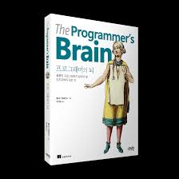

# M3 프로그래밍 1기

## 세미나 진행 순서

1. (선택) 사전 과제 진행
   약 1시간 정도, 걸릴 것으로 예상됩니다.
   연휴 기간동안 팀원들은 과제를 진행하고 PR 을 올릴지 선택할 수 있습니다.
   과제를 진행할 시에, 세미나 전 본인이 작성했던 코드와 세미나 후 코드를 비교해 볼 수 있어 학습 효과가 좋습니다.

2. OOP(객체지향 프로그래밍), TDD(Test Driven Development), 짝 프로그래밍(Pair Programming) 등에 대한 개념을 소개합니다.

3. 짝 프로그래밍
    1. 두 명씩 짝을 지어서 객체 설계 과정을 거칩니다.
    2. 해당 짝과 함께 실습을 진행합니다.
        1. 빨리 끝났을 시에 새로운 요구사항을 추가하여 작성했던 코드를 얼마나 유연하게 변경할 수 있을지 실습합니다.

4. Live Coding
    1. 실습 요구사항 중 일부를 Live 로 코딩하는 모습을 보여줍니다.
    2. 간단히 TDD(Test Driven Development) 과 닮아 있는 방식으로 코딩하는 것을 보여줍니다.

5. 세미나 이후 의견을 공유해보기
    1. 정말 필요한 기술인지 고민해보기
    2. M3Mobile 에서 어떻게 적용할 수 있을지 고민하기

# 세미나 자료

## **객체** 지향 프로그래밍


객체 지향 프로그래밍만 검색해도 많은 양의 서적이 나온다.

객체 지향 프로그래밍이 뭔데?

## 객체지향 프로그래밍 VS 절차지향 프로그래밍

절차 지향 프로그래밍은 데이터를 중심으로, 정해진 순서의 **절차(함수)**를 따라 코드를 실행하는 방식이다.

반면 **객체 지향 프로그래밍은 실제 세상처럼 데이터와 관련 행동(메서드)을 하나의 '객체'로 묶어,
객체들 간의 상호작용으로 프로그램을 설계**한다.

객체 지향이 코드의 재사용성과 유지보수가 용이하여, 더 복잡하고 큰 규모의 프로젝트에 적합하다.

## 객체를 지향한다?

객체지향 프로그래밍의 개념을 성립한 사람 중 한 명 앨런 케이


> 나는 OOP를 발명했지만, C++는 내 의도와 거리가 멀다. 나는 '객체'보다 '메시징'을 훨씬 중요하게 생각했다.

결국 **객체를 지향한다**  는 것은?,

우리 시스템에

1. 어떤 **자율적인 전문가(객체)** 들이 필요한지 고민하고,
2. 그들에게 **각자의 책임을 명확히 부여**한 뒤,
3. 이 전문가들이 **서로 협력하여 문제를 해결**하도록 믿고 맡기는 설계 방식

## 메시징 지향 프로그래밍?

* 메시지는
    * **'어떻게'가 아닌 '무엇을'** 할지 묻는 약속
    * 객체 간 **협력을 위한 유일한 소통 창구**


그가 생각한 프로그래밍의 본질이 객체의 내부 구조가 아닌,**객체 간의 관계와 소통 방식**에 있다.
즉, **자율적인 책임**과 **유기적인 협력**이 중요하다!

## 책임, 역할, 협력

1. 객체는 **자율적인 책임**을 가진다.
    * 객체는 자신의 데이터는 자신이 알아서 처리한다.
    * 외부에서는 객체에게 데이터를 달라고 요청해서 마음대로 조작하는 게 아니라,
    * '네가 가진 데이터를 가지고 이 일을 수행해줘' 라고 **요청(메시지 전송)**할 뿐이다.

2. **객체는 서로 협력**한다.
    * 혼자서 모든 것을 다 하는 슈퍼맨 객체는 없다.
    * 각자 자신의 책임을 다하는 작은 객체들이 서로에게 메시지를 보내 도움을 요청하며,
    * 거대한 문제를 함께 해결해 나가는 협력의 공동체를 만드는 것이다.

## 의인화

* 절차 지향 프로그램에서는 데이터와 행동이 나뉘어져 있다.
  

* 객체 지향 프로그램에서는 객체가 자신의 데이터로 자율적인 책임을 수행한다.
  

## 초간단 자동차 경주 예시

초간단 자동차 경주 게임의 요구사항이 아래와 같다고 하자.

* 사용자의 자동차는 전진할 수 있다.
* 전진하는 조건은 0에서 9 사이에서 무작위 값을 구한 후 무작위 값이 4 이상일 경우이다.

위와 같은 요구사항을 구현한다고 하자.

```java
public class Car {
    final String name;
    int position;

    public Car(String name, int position) throws IllegalArgumentException {
        if (name.isBlank()) throw new IllegalArgumentException("이름은 공백일 수 없습니다");
        if (position < 0) throw new IllegalArgumentException("위치는 0보다 작을 수 없습니다");
        this.name = name;
        this.position = position;
    }

    void move() {
        Random random = new Random();
        int randomNumber = random.nextInt(9) + 1;

        if (randomNumber >= 4) {
            position++;
        }
    }
}
```

굉장히 간단하다.
하지만 테스트 코드를 작성한다면?

랜덤 요소 때문에 테스트 코드를 작성할 수 없다.

### 객체를 분리해보자

현재 `Car` 클래스는 굉장히 짧은 코드이지만 여러 책임을 가지고 있다.

* 자동차의 위치를 전진시킨다.
* 자동차가 움직일 수 있는지 판단한다.

두 책임은 다른 두 객체에 할당될 수 있다.

```java
public class Car {
    private final String name;
    private final Position position;
    private final MoveStrategy moveStrategy;

    public Car(String name, Position position, MoveStrategy moveStrategy) {
        if (name.isBlank()) throw new IllegalArgumentException("이름은 공백일 수 없습니다");
        this.name = name;
        this.position = position;
        this.moveStrategy = moveStrategy;
    }

    public Car moved() {
        if (moveStrategy.canMove()) {
            return new Car(name, position.moved(), moveStrategy);
        }
        return this;
    }
}
```

```java
public interface MoveStrategy {
    boolean canMove();
}

public class RandomNumberMoveStrategy implements MoveStrategy {
    private final Random random = new Random();

    @Override
    public boolean canMove() {
        int randomNumber = random.nextInt(9) + 1;
        return randomNumber >= 4;
    }
}
```

```java
public class Position {
    int position;

    public Position(int position) throws IllegalArgumentException {
        if (position < 0) throw new IllegalArgumentException("위치는 0보다 작을 수 없습니다");
        this.position = position;
    }

    public Position moved() {
        return new Position(position + 1);
    }
}
```

### 테스트 코드를 작성해보자

여전히 `RandomNumberMoveStrategy` 는 테스트가 불가능하지만, `Position` 은 테스트가 가능하다.

#### PositionTest

```java
class PositionTest {
    @Test
    @DisplayName("Position 이 음수에 위치하게 되면 예외를 발생시킨다.")
    void createPosition_withNegativeValue_throwsIllegalArgumentException() {
        // given
        int negativePosition = -1;

        // when & then
        Assertions.assertThatThrownBy(() -> new Position(negativePosition))
                .isInstanceOf(IllegalArgumentException.class);
    }


    @Test
    @DisplayName("Position 이 양수에 위치하게 되면 예외를 발생시키지 않는다.")
    void createPosition_withPositiveValue_not_throwsIllegalArgumentException() {
        // given
        int positivePosition = 1;

        // when & then
        Assertions.assertThatCode(() -> new Position(positivePosition))
                .doesNotThrowAnyException();
    }

    @ParameterizedTest
    @CsvSource(value = {"0,1", "1,2", "10,11"})
    @DisplayName("moved 메서드는 현재 위치에서 1 증가된 새로운 Position 객체를 반환한다. (Parameterized)")
    void moved_returnsNewPositionWithIncrementedValue_parameterized(int currentPos, int expectedMovedPos) {
        // given
        Position currentPosition = new Position(currentPos);

        // when
        Position movedPosition = currentPosition.moved();

        // then
        Assertions.assertThat(movedPosition.position).isEqualTo(expectedMovedPos);
    }
}
```

#### 랜덤 요소에 의존하는 클래스의 테스트

그렇다면 여전히 `Car` 의 테스트는 불가능한가?
그리고 `Car` 를 사용하는 다른 클라이언트 코드들의 테스트도 모두 불가능한가?

Fake 객체를 만든다면 가능하다.

```java
public class FakeMoveStrategy implements MoveStrategy {
    private final boolean canMove;

    public FakeMoveStrategy(boolean canMove) {
        this.canMove = canMove;
    }

    @Override
    public boolean canMove() {
        return canMove;
    }
}
```

```java
class CarTest {
    @Test
    void 자동차_이름이_공백이면_예외가_발생한다() {
        assertThatThrownBy(() -> new Car(
                "",
                new Position(0),
                new FakeMoveStrategy(true))
        )
                .isInstanceOf(IllegalArgumentException.class)
                .hasMessage("이름은 공백일 수 없습니다");
    }

    @Test
    void 자동차는_전진할_수_있다() {
        // given
        Car car = new Car(
                "testCarName",
                new Position(0),
                new FakeMoveStrategy(true));

        // when
        Car movedCar = car.moved();

        // then
        assertThat(movedCar).isNotSameAs(car);
    }
}
```

## 이렇게까지 해야 하나?

> "요구사항도 간단한데, 굳이 클래스를 여러 개로 나누고 인터페이스까지 만들면서 복잡하게 만들어야 하나요?"

합리적인 판단이다. 사실 이 정도 규모에서는 굳이 책임을 분리하지 않아도 된다.

로버트 마틴(Uncle Bob)이 말한 **좋은 소프트웨어의 세 가지 원칙**


-----

### 1. 소프트웨어는 제대로 작동해야 한다.

너무나 당연한 말이다.

어떤 기능을 만들고 제대로 작동하는지 항상 뷰까지 만들고 테스트해야 하나?

### 2. 소프트웨어는 읽기 위한 것이다. (Readability)

사실 대부분의 개발자는 코드를 작성하는 시간보다 읽는 시간이 더 많다!
당연히 AI 도 그렇다.(바이브 코딩)

나 자신을 포함한 미래의 동료들이 코드를 쉽게 이해할 수 있어야 한다.

#### 프로그래머의 뇌 - 펠리너 헤르만스



* 큰 단위의 코드를 읽는 것보다 작은 단위로 나뉜 여러 코드를 읽는 것이 더 읽기 쉽다.
    * 심지어 후자의 코드 라인 수가 더 많더라도!
* 우리는 1 시간 이내의 읽은 것들의 상당한 양을 잊어버린다고 한다.
    * > 어.. 이거 내가 어제 작성한 코드인데 이게 무엇을 의미하는 코드더라?

나 자신을 포함한 미래의 동료들이 코드를 쉽게 이해할 수 있어야 한다.

잘 읽히는 코드는 이해하기 쉽고, 버그를 줄이며, 팀의 개발 속도를 높이는 가장 강력한 자산이다.

### 3. 소프트웨어는 변경을 위한 것이다.

소프트웨어의 유일한 불변의 진리는 **요구사항은 반드시 변한다**는 것!!

좋은 코드는 이러한 변경에 유연하게 대처할 수 있어야 한다.

#### 예시

> **더 좋은 엔진을 장착해서 2 이상만 나오면 전진하는 고급 자동차**를 추가해주세요.

이동 여부를 결정하는 전략(Strategy)의 로직만 바꿀 뿐, **전진한다는 행위 자체는 바꾸지 않는다.**

최초의 코드를 변경한다고 해보자.

```java
// 최초의 Car 클래스 내부
void move() {
    Random random = new Random();
    int randomNumber = random.nextInt(10);

    // 자동차 종류에 따라 분기하는 로직이 추가된다!
    int moveCondition = 4;
    if (this.type.equals("PREMIUM")) {
        moveCondition = 2;
    }

    if (randomNumber >= moveCondition) {
        position++;
    }
}
```

필요에 따라 해당 전략을 '주입'하여 자동차를 생성할 수 있다.

```java
Car normalCar = new Car("자동차 이름 노멀", new Position(0), new RandomNumberMoveStrategy());
Car premiumCar = new Car("자동차 이름 고급", new Position(0), new PremiumMoveStrategy());
Car testCar = new Car("자동차 이름 테스트", new Position(0), new FakeMoveStrategy(true));
```

> OCP(Open Closed Principal): 확장에는 열려있지만 수정에는 닫혀있다!

## 페어 프로그래밍


**두 명의 개발자가 하나의 컴퓨터에서 함께 소프트웨어를 개발하는 방식**

단순히 두 사람이 각자 코딩하는 것이 아니라, 명확한 역할을 가지고 협력합니다.

* **드라이버 (Driver):**
    * 키보드를 잡고 직접 코드를 작성하는 사람
    * 눈앞의 코드를 구현하는 '전술적인' 역할에 집중
* **내비게이터 (Navigator):**
    * 옆에서 코드를 함께 보며 생각하는 사람
    * 더 큰 그림을 보고, 잠재적인 버그를 찾거나, 다음에 무엇을 해야 할지, 더 좋은 설계는 없을지 고민하는 '전략적인' 역할

**중요한 점은, 이 두 역할을 주기적으로 (15~20분마다) 교대한다.**
이를 통해 두 사람 모두 적극적으로 참여하고, 다양한 관점에서 문제를 바라보게 됩니다.

---

### 2. 페어 프로그래밍의 장점: 왜 함께해야 할까요?

"인력이 둘인데, 문제 하나에 붙으면 손해 아닌가요?"

혼자 하는 것보다 비효율적이라고 생각할 수도 있지만, 페어 프로그래밍은 개인과 팀 모두에게 이점을 가져다줍니다.

#### **1) 압도적으로 향상된 코드 품질**


* 내비게이터는 실시간 코드 리뷰어의 역할을 합니다.
    * 오타나 간단한 논리적 오류는 코드가 작성되는 순간에 바로잡힙니다.
    * 혼자서는 놓치기 쉬운 예외 케이스나 설계의 허점을 동료가 즉시 발견해주므로, 버그가 훨씬 적고 견고한 코드가 만들어집니다.

#### **2) 빠른 속도의 지식 공유 (Bus Factor 감소)**

* **"이 코드는 xxx 님만 알아요"**
    * 만약 김대리님이 갑자기 휴가를 가거나 퇴사하면?
* **버스 팩터(Bus Factor)**: 이 프로젝트는 N 명이 버스에 치이면 망한다
    * 특정인 1명에게 지식이 몰려있으면 버스 팩터는 1이 됩니다.


* 페어 프로그래밍은 문제를 해결하는 강력한 도구
    * 한 사람이 아는 단축키, 디버깅 노하우, 특정 라이브러리 지식, 설계 의도 등이 페어링을 하는 동안 자연스럽게 동료에게 전파된다.
    * 팀 전체의 지식 수준이 빠르게 상향 평준화됩니다.

#### **3) 높은 집중력과 생산성**


* 누군가 옆에서 함께 지켜보고 있으면 이메일을 확인하거나 졸거나 잠시 다른 생각을 하기가 어렵다.
    * 페어는 서로가 문제에 계속 집중하도록 돕는 훌륭한 '페이스메이커'가 되어줍니다.
    * 이로 인해 코드 작성의 흐름이 끊기지 않고, 결과적으로 더 짧은 시간에 더 높은 품질의 결과물을 만들어내는 경우가 많습니다.

#### **4) 팀워크와 소통 능력 강화**


> "저는 이 부분을 클래스로 분리하고 싶은데, 왜냐하면..."

* 페어 프로그래밍을 하려면 내 생각을 끊임없이 말로 설명해야 합니다.
    * 같이 소통하는 과정에서 문제에 대한 이해가 깊어지고, 팀원 간의 협업 방식과 문화가 자연스럽게 형성됩니다.

---

## 라이브 코딩

작은 객체의 테스트부터 작성하고 테스트를 실패한 뒤, 테스트를 성공하도록 기능을 구현하는 모습을 보여줍니다.

## 우리 회사에는 어떻게 적용할 수 있을까?

## 기타

실습 코드를 가이드에 맞게 PR 을 올려주신다면, 제가 퇴근 이후에 시간을 내어 코드 리뷰를 달아드리겠습니다.

코드 리뷰 이후, 리뷰받은 사항을 코드에 다시 반영하는 것은 선택입니다.

## 추천하는 책

- [객체 지향의 사실과 오해 - 조영호 저자](https://product.kyobobook.co.kr/detail/S000001628109)
    - 책의 목적은 특정한 기술이나 언어를 설명하는 데 있지 않다. 대신 객체지향적으로 세상을 바라본다는 것이 무엇을 의미하는지를 설명하는 데 있다. 이를 위해 많은 사람들이
      가지고 있는 객체지향에 관한 잘못된 편견과 선입견의 벽을 하나씩 무너트려가면서 객체지향이 추구하는 가치를 전달한다.
      이 책을 읽고 나면 기존의 선입견에서 벗어나 다음과 같은 객체지향의 진실과 마주하게 될 것이다.
    - 260 페이지 분량이지만, 글씨의 크기가 커서 3시간이면 완독합니다.
    - **이 책의 내용을 제대로 이해한다면, 아래 책은 읽을 필요성이 크지는 않다고 생각합니다.**
- [오브젝트 코드로 이해하는 객체지향 설 - 조영호 저자](https://product.kyobobook.co.kr/detail/S000001766367)
    - 객체지향으로 향하는 첫걸음은 클래스가 아니라 객체를 바라보는 것에서부터 시작한다. 객체지향으로 향하는 두번째 걸음은 객체를 독립적인 존재가 아니라 기능을 구현하기 위해
      협력하는 공동체의 존재로 바라보는 것이다. 세번째 걸음을 내디딜 수 있는지 여부는 협력에 참여하는 객체 들에게 얼마나 적절한 역할과 책임을 부여할 수 있느냐에 달려
      있다. 객체지향의 마지막 걸음은 앞에서 설명한 개념들을 여러분이 사용하는 프로그래밍 언어라는 틀에 흐트러짐 없이 담아낼 수 있는 기술을 익히는 것이다.
    - 자바 뿐 아니라 다양한 프로그래밍 언어가 예시로 나온다. 하지만 해당 언어에 대한 이해가 없어도 괜찮습니다.
    - 책이 두껍고 내용이 많습니다. 정독보다는 발췌독을 추천합니다.
- [엘레강트 오브젝트 - Yegor Bugayenko 저자, 조영호 번역](https://product.kyobobook.co.kr/detail/S000001902572)
    - 본인이 힙스터이고, 객체지향 프로그래밍에 푹 빠져든 사람이라면 이 책을 추천합니다.
    - 하지만 약간 극단적으로 객체지향 프로그래밍에 집착한다는 평도 있습니다.
    - 책에서 말하는 내용이 항상 정답이라고 생각하지 않을 수 있다면 읽어보는 것을 추천합니다.
    - 그런데 절판되었네요... ㅠㅜ
