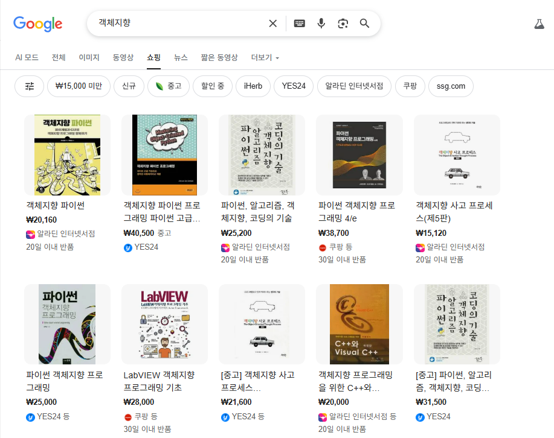

# M3 프로그래밍 1기

## 세미나 진행 순서

1. (선택) 사전 과제 진행
   약 1시간 정도, 걸릴 것으로 예상됩니다.
   연휴 기간동안 팀원들은 과제를 진행하고 PR 을 올릴지 선택할 수 있습니다.
   과제를 진행할 시에, 세미나 전 본인이 작성했던 코드와 세미나 후 코드를 비교해 볼 수 있어 학습 효과가 좋습니다.

2. OOP(객체지향 프로그래밍), TDD(Test Driven Development), 짝 프로그래밍(Pair Programming) 등에 대한 개념을 소개합니다.

3. 짝 프로그래밍
    1. 두 명씩 짝을 지어서 객체 설계 과정을 거칩니다.
    2. 해당 짝과 함께 실습을 진행합니다.

4. Live Coding

실습 요구사항 중 일부를 Live 로 코딩하는 모습을 보여줍니다.

## **객체** 지향 프로그래밍

* 객체지향 프로그래밍이 뭔데??
* 객체지향 프로그래밍 VS 절차지향 프로그래밍

### 객체지향 프로그래밍 VS 절차지향 프로그래밍

절차 지향 프로그래밍은 데이터를 중심으로, 정해진 순서의 '절차(함수)'를 따라 코드를 실행하는 방식입니다.

반면 **객체 지향 프로그래밍은 실제 세상처럼 데이터와 관련 행동(메서드)을 하나의 '객체'로 묶어, 객체들 간의 상호작용으로 프로그램을 설계**합니다.

객체 지향이 코드의 재사용성과 유지보수가 용이하여, 더 복잡하고 큰 규모의 프로젝트에 적합합니다.

### 객체를 지향한다?

객체지향 프로그래밍의 개념을 성립한 사람 중 한 명 앨런 케이

> 나는 OOP를 발명했지만, C++는 내 의도와 거리가 멀다. 나는 '객체'보다 '메시징'을 훨씬 중요하게 생각했다.

### 객체를 지향한다!

결국 **'객체를 지향한다'**는 것은?, 

우리 시스템에 
1. 어떤 **자율적인 전문가(객체)**들이 필요한지 고민하고, 
2. 그들에게 **각자의 책임을 명확히 부여**한 뒤, 
3. 이 전문가들이 **서로 협력하여 문제를 해결**하도록 믿고 맡기는 설계 방식

### 메시징 지향 프로그래밍?

* 메시지는 
  * **'어떻게'가 아닌 '무엇을'** 할지 묻는 약속
  * 객체 간 **협력을 위한 유일한 소통 창구**

그가 생각한 프로그래밍의 본질이 객체의 내부 구조가 아닌,**객체 간의 관계와 소통 방식**에 있다. 
즉, **자율적인 책임**과 **유기적인 협력**이 중요하다! 

### 책임, 역할, 협력

1. 객체는 **자율적인 책임**을 가진다.
   * 객체는 자신의 데이터는 자신이 알아서 처리한다.
   * 외부에서는 객체에게 데이터를 달라고 요청해서 마음대로 조작하는 게 아니라,
   * '네가 가진 데이터를 가지고 이 일을 수행해줘' 라고 **요청(메시지)**할 뿐이다.

2. 객체는 서로 **'협력'**한다.
   * 혼자서 모든 것을 다 하는 슈퍼맨 객체는 없다.
   * 각자 자신의 책임을 다하는 작은 객체들이 서로에게 메시지를 보내 도움을 요청하며,
   * 거대한 문제를 함께 해결해 나가는 협력의 공동체를 만드는 것이다.

## 페어 프로그래밍

## 라이브 코딩

## 우리 회사에는 어떻게 적용해야 도움이 될까?

