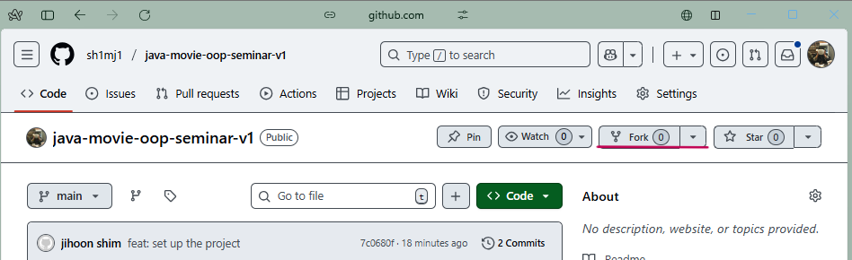

# 영화 예매 - 실습

이 실습은 Next Step 과 우아한테크코스에서의 미션(과제) 등의 진행방식을 기반으로 합니다.

실제 미션의 요구사항 중 일부분만을 가져온 것입니다.

이 실습의 모든 영리적인 권한은 Next Step 과 우아한 형제들에 있으며, 영리적인 사용을 금합니다.

현 세미나에서는 기존 강의자에게 직접 허락을 받은 내용입니다.

## 실습 진행 방식

### 진행 방식

* 실습의 요구사항은 아래 세 가지로 구성되어 있다. 세 요구 사항을 만족하기 위해 노력한다.
    1. 과제 진행 요구 사항
    2. 기능 요구 사항
    3. 프로그래밍 요구 사항

기능을 구현하기 전에 기능 목록을 만들고, 기능 단위로 커밋하는 방식으로 진행한다.

기능 요구 사항에 기재되지 않은 내용은 스스로 판단하여 구현한다.

프로그래밍 요구 사항은 단순한 규칙이 아니라 문제를 분해하고 명확하게 설계하는 훈련을 위한 장치임을 이해하고 지킨다.

AI 도구를 사용할 수 있으나, 문제를 이해하지 않고 단순히 복사해서 붙여 넣는 것은 허용하지 않는다.

### 실습 제출 방법

실습 구현을 완료한 후 GitHub을 통해 제출해야 한다.

GitHub을 활용한 제출 방법은 프리코스 진행 가이드 문서를 참고해 제출한다.

풀 리퀘스트 제목은 '[$이름] 실습 제출.'로 작성한다.

### 실습 진행 소감

자유롭게 이야기 한다.

(선택) 팀원에게 공유하고 싶은 소감 내용이 있는 경우, 팀즈 'APP 팀 지식 공유 채널'에 공유해도 좋다..

#### 예시

> 실습은 생각만큼 쉽지 않았습니다. <br>
> 처음에는 AI를 사용해 초안을 만들었지만 그대로 쓰지 않고 코드를 분석하며 이해하려고 노력하였습니다.  <br>
> 그 과정에서 함수 분리와 테스트 작성의 필요성을 더 잘 알게 되었습니다.  <br>
> 기능을 분리해 기능 단위로 커밋하는 것이 쉽지 않았지만, 연습을 통해 점차 익숙해졌습니다. <br>

### 과제 제출 전 체크리스트

* 터미널에서 `java -version` 을 실행하여 Java 버전이 21인지 확인한다.
* Eclipse 또는 IntelliJ IDEA와 같은 IDE에서 Java 21로 실행되는지 확인한다.
* 터미널에서 Mac 또는 Linux 사용자의 경우 `./gradlew clean test` 명령을 실행하고, Windows 사용자의 경우
  `gradlew.bat clean test` 또는 `./gradlew.bat clean test` 명령을 실행할 때 모든 테스트가 아래와 같이
  통과하는지 확인한다.

## 요구사항

### 과제 진행 요구 사항

* 미션은 영화 예매 저장소를 포크하고 클론하는 것으로 시작한다.
* 기능을 구현하기 전 README.md 에 구현할 기능 목록을 작성하고, 구현 전략을 함께 정리한다.
* Git의 커밋 단위는 앞 단계에서 README.md 에 정리한 기능 목록 단위로 추가한다.
    * [AngularJS Git Commit Message Conventions](https://gist.github.com/stephenparish/9941e89d80e2bc58a153)
      을 참고해 커밋 메시지를 작성한다.
* AI 도구를 활용하였다면, README.md 에 활용한 방식과 코드를 어떻게 수정하였는지, 무엇을 학습하였는지 기록한다.
* 자세한 과제 진행 방법은 프리코스 진행 가이드 문서를 참고한다.

### 기능 요구 사항

쉽고 빠르게 영화 예매 시 결제해야 하는 금액을 알려주는 프로그램을 작성한다.

* 특정한 조건을 만족하는 예매자는 추가 혜택을 받을 수 있다.
    * 무비데이 조건: 매월 10일, 20일, 30일에 상영되는 영화는 10% 할인된다.
    * 시간 조건: 오전 11시 이전 또는 오후 8시 이후에 시작하는 상영은 2,000원이 할인된다.
    * 두 조건이 동시에 적용될 수 있으며, 무비데이 할인(비율)이 먼저 적용되고, 이어서 시간 조건 할인(정액)이 적용된다.
* 좌석은 아예 고를 수 없다. 앞으로도 생길 가능성이 0% 라고 가정한다.
* 실제 결제는 구현하지 않는다.

#### 프로그래밍 요구 사항 1

* JDK 21 버전에서 실행 가능해야 한다.
* 프로그램 실행의 시작점은 Application 의 main() 이다.
* build.gradle 파일은 변경할 수 없으며, 제공된 라이브러리 이외의 외부 라이브러리는 사용하지 않는다.
* 프로그램 종료 시 System.exit() 를 호출하지 않는다.
* 콘솔 입출력은 구현하지 않는다. 입력과 출력보다는 객체 설계와 도메인 로직, 테스트 코드 작성에 집중한다.
* 프로그래밍 요구 사항에서 달리 명시하지 않는 한 파일, 패키지 등의 이름을 바꾸거나 이동하지 않는다

#### 프로그래밍 요구 사항 2

* 자바 코드 컨벤션을 지키면서 프로그래밍한다.
    * 기본적으로 [Google Java Style Guide](https://google.github.io/styleguide/javaguide.html)를 원칙으로 한다.
* 들여쓰기 단계가 3을 넘지 않도록 구현한다. 2까지만 허용한다.
    * 예를 들어, `while` 문 안의 `if` 문은 들여쓰기 2이다.
    * 힌트: 들여쓰기 단계를 줄이는 좋은 방법은 함수를 분리하는 것이다.
* 함수(또는 메서드)의 길이가 10줄을 넘어가지 않도록 구현한다.
    * 함수는 한 가지 일만 하도록 작성한다.
* `else` 키워드를 쓰지 않는다.
    * `switch`문도 허용하지 않는다.
    * 힌트: `if`문에서 값을 반환하는 방식으로 구현하면 `else`를 사용하지 않아도 된다.
* 3항 연산자를 쓰지 않는다.
* 정리한 기능 목록이 정상적으로 작동하는지 JUnit 5와 AssertJ로 테스트한다.
    * 테스트 도구 사용법이 익숙하지 않다면 아래 문서를 참고한다.
        * [Junit 5 User Guide](https://docs.junit.org/current/user-guide/)
        * [AssertJ User Guide](https://assertj.github.io/doc)
        * [AssertJ Exception Assertions](https://www.baeldung.com/assertj-exception-assertion)
        * [Guide to Junit5 Parameterized Tests](https://www.baeldung.com/parameterized-tests-junit-5)

# 실습 진행 가이드

## 1. 저장소를 내 계정으로 포크하기



포크는 `upstream` 저장소라고도 하는 원본 저장소에 영향을 미치지 않고 프로젝트를 변경하도록 해준다.
저장소를 포크한 후, 원본 저장소에서 업데이트를 가져와 포크를 최신 상태로 유지하고, 풀 리퀘스트를 사용하여
포크에서 원본 저장소로 변경 내용을 제안할 수 있다.

## 실행 결과

포크 완료 후 저장소 상태는 아래와 같다.

TODO: 포크 결과 이미지를 잘 만들기.

## 2. 포크된 저장소를 내 컴퓨터로 클론하기

저장소를 클론하려는 적절한 디렉토리로 이동하여 터미널에 다음과 같은 명령을 입력한다.

```
git clone https://github.com/{사용자 이름}/{저장소 이름}.git
```

> e.g
> ```
> git clone https://github.com/sh1mj1/java-movie-oop-seminar-v1.git 
> ```

TODO: 클론한 저장소 이미지 만들기

## 3. 기능 구현을 위한 브랜치 만들기

터미널에서 다음 명령을 입력하여 브랜치를 만듭니다.

```
git checkout -b {사용자_이름}
```

> e.g
> ```
> git checkout -b sh1mj1
> ```

모든 버전 관리 시스템은 브랜치를 지원합니다.
개발 중에는 코드를 여러 개의 복사본으로 복사해야 하는 경우가 종종 있습니다.
코드 전체를 복사한 후에는 원본 코드와 독립적으로 개발할 수 있으며,
이렇게 독립적으로 개발하는 것을 브랜치라고 합니다.

### 실행 결과

TODO: 이미지 잘 만들기.

## 4. 통합 개발 환경(IDE)로 가져오기

미션 진행을 위해 저장소를 즐겨 사용하는 통합 개발 환경(IDE)으로 가져옵니다. (안드로이드 스튜디오 가능)

### 4.1 안드로이드 스튜디오 혹은 InteliJ IDEA 으로 가져오기

1. IntelliJ IDEA 를 실행합니다.
2. Import Project 를 선택합니다.
3. 앞서 클론한 저장소의 디렉토리를 선택합니다.
4. `Import Project from external model` 을 선택하고, Gradle -> Next 를 선택합니다.
5. 다음 화면에서 Finish 를 클릭하여 가져오기를 완료합니다.

## 5. 기능 구현하기

미션 요구 사항을 파악하고 기능을 구현하세요.

## 6. 기능 구현 후 `git add`, `commit`

기능 구현을 완료한 후 `git add` 및 `git commit` 명령을 사용하여 변경 사항을 로컬 저장소에 반영합니다.

```
git status # 변경된 파일 확인
git add . # 변경된 모든 파일을 한 번에 반영 
# 또는 git add -A
git commit -m "message" # 작업 내용을 메시지에 쓰기
```

## 실행 결과

기능 구현을 완료하고 `git add` 및 `git commit` 명령을 실행한 후의 상태는 아래와 같습니다.

## 7. 원격 저장소에 올리기

로컬에서 git commit 명령을 실행하면 원격 저장소가 아닌 로컬 저장소에만 반영된다.
원격 저장소에도 동일하게 반영하려면 `git push` 명령을 사용한다.

```
git push origin {사용자_이름}
```

> e.g
> `git push origin sh1mj1`

## 실행 결과

`git push` 명령을 실행한 후의 상태는 아래와 같습니다.

## 8. GitHub 에서 풀 리퀘스트 만들기

풀 리퀘스트는 코드 리뷰를 요청하는 데 사용하는 GitHub 에서 제공하는 기능입니다.
풀 리퀘스트는 원본 저장소의 `main` 브랜치와 이전 단계에서 원격 저장소에 올린 브랜치를 기반으로 합니다.

1. 브라우저에서 GitHub 원격 저장소에 접근합니다.
2. 브랜치를 작업 브랜치로 변경합니다.
3. 브랜치 오른쪽에 있는 `New pull request` 버튼을 클릭합니다.
4. 현재 미션에서 작업한 내용을 입력하고 `Create pull request` 버튼을 클릭해 풀 리퀘스트를 만듭니다.

## 실행 결과

풀 리퀘스트를 만들었을 대의 상태는 아래와 같습니다.

## 9. 실습 제출

* 실습을 제출하시면 해당 PR 에 코드 리뷰를 달아드립니다. 
* 코드 리뷰 코멘트는 항상 정답은 아닙니다.
